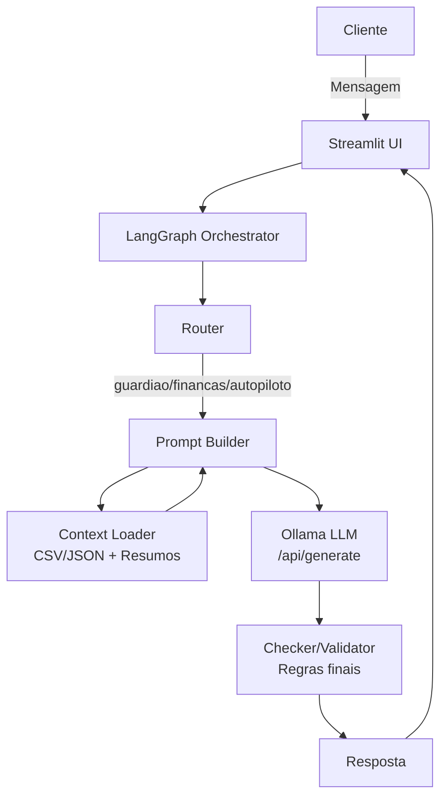

# Documentação do Agente

## Caso de Uso

### Problema

O cliente de banco (ou fintech) costuma ter dúvidas e dores recorrentes em três frentes:

1. **Segurança**: golpes cada vez mais convincentes (WhatsApp, SMS, ligação falsa, taxa de liberação, Pix noturno, favorecido novo etc.).
2. **Educação financeira**: dificuldade em entender conceitos e tomar decisões básicas com clareza (juros, inflação, orçamento, reserva).
3. **Organização e disciplina**: falta de um plano prático para controlar gastos, reduzir rotativo/juros e criar reserva, usando o próprio histórico de transações como base.

Sem apoio, o cliente perde dinheiro com golpes, toma decisões por impulso, ou fica travado por não entender o que está acontecendo nas próprias finanças.

### Solução

O **San** é um chatbot multiagente que atua de forma **consistente e orientada por regras**, usando dados do cliente para personalizar a resposta. Ele:

* **Detecta automaticamente a necessidade** (segurança vs educação vs planejamento) usando roteamento;
* Seleciona o **agente ideal** (Guardião, Finanças, Autopiloto);
* Monta um prompt com o **contexto certo** (perfil + transações + histórico + produtos resumidos, com filtros por agente);
* Gera a resposta via LLM (Ollama local);
* Passa por uma etapa final de **validação/checker**, garantindo limites de resposta e reforçando segurança.

Na prática, isso transforma perguntas soltas do cliente em **orientação objetiva e segura**, sem pedir dados sensíveis.

### Público-Alvo

* Clientes de bancos digitais/fintechs que:

  * sofrem com tentativas de golpe ou suspeitam de fraude;
  * querem aprender finanças pessoais de forma simples;
  * precisam organizar orçamento, controlar gastos e reduzir dívidas.
* Times internos (atendimento/CS/anti-fraude) usando a solução como **assistente** para padronizar orientações.

---

## Persona e Tom de Voz

### Nome do Agente

**San**

### Personalidade

O projeto possui **3 personas** (3 modos), cada uma com regras e objetivos específicos:

* **San Guardião (anti-golpe)**: direto, protetivo e objetivo. Prioriza risco, motivo e ação imediata.
* **San Finanças (educador)**: amigável, didático e simples. Ensina conceitos sem recomendar investimentos específicos.
* **San Autopiloto (planejamento)**: prático e orientado a hábitos. Ajuda a organizar orçamento e criar planos simples.

### Tom de Comunicação

* **Acessível e informal** (como conversar com um amigo), mas sem perder clareza.
* Respostas curtas (no máximo **3 parágrafos**).
* **Nunca** solicita senha, token, códigos, foto de documento ou dados sensíveis.

### Exemplos de Linguagem

* Saudação: “Beleza — me conta o que aconteceu e eu te digo o risco e o que fazer agora.”
* Confirmação: “Entendi. Vou olhar isso com base no teu perfil e nas transações recentes.”
* Erro/Limitação: “Não tenho essa informação exata aqui, mas posso explicar como isso funciona e qual é o caminho seguro.”

---

## Arquitetura

### Diagrama

### Componentes

| Componente           | Descrição                                                                                                                        |
| -------------------- | -------------------------------------------------------------------------------------------------------------------------------- |
| Interface            | Chat em **Streamlit** (`st.chat_input`, `st.chat_message`, histórico em `st.session_state`)                                      |
| Orquestração         | **LangGraph** com fluxo: `router → build_prompt → llm → checker`                                                                 |
| LLM                  | **Ollama local** via endpoint HTTP (`/api/generate`) com modelo leve (ex.: `llama3.2`)                                           |
| Base de Conhecimento | Arquivos locais do dataset: `perfil_investidor.json`, `transacoes.csv`, `historico_atendimento.csv`, `produtos_financeiros.json` |
| Context Loader       | `carregar_contexto()` com `st.cache_data` + redução de contexto (tail + resumo)                                                  |
| Validação            | `checker_node`: limita a até 3 parágrafos e reforça proibição de dados sensíveis                                                 |
| Roteamento           | Heurístico por palavras-chave + possibilidade de override manual (`@guardiao`, `@financas`, `@autopiloto`)                       |

---

## Segurança e Anti-Alucinação

### Estratégias Adotadas

* [x] **Roteamento com prioridade de segurança**: se houver sinais de golpe/fraude, o Guardião assume.
* [x] **Regras explícitas por persona** (system prompts) para evitar mudança de comportamento.
* [x] **Contexto controlado**: redução do número de linhas de transações/histórico e resumo de produtos para evitar prompt gigante e ruído.
* [x] **Checker final**: aplica regras depois do LLM (máx. 3 parágrafos e reforço de não compartilhar senha/token/códigos).
* [x] **Não recomenda investimentos específicos** (Finanças/Autopiloto focam em educação e planejamento).
* [x] **Não solicita dados sensíveis** em nenhum modo (senha, token, códigos, foto de documento etc.).

### Limitações Declaradas

O agente **NÃO**:

* executa transações (Pix/TED/transferências) nem “confirma” operações no app;
* acessa sistemas reais do banco (tudo é baseado em **dados do dataset** e no texto do usuário);
* fornece recomendações de investimento específicas (apenas explica conceitos e organização);
* coleta ou armazena dados sensíveis do cliente (e não deve pedir);
* garante detecção perfeita de golpes: ele reduz risco e orienta boas práticas, mas o cliente deve validar sempre em canais oficiais.

